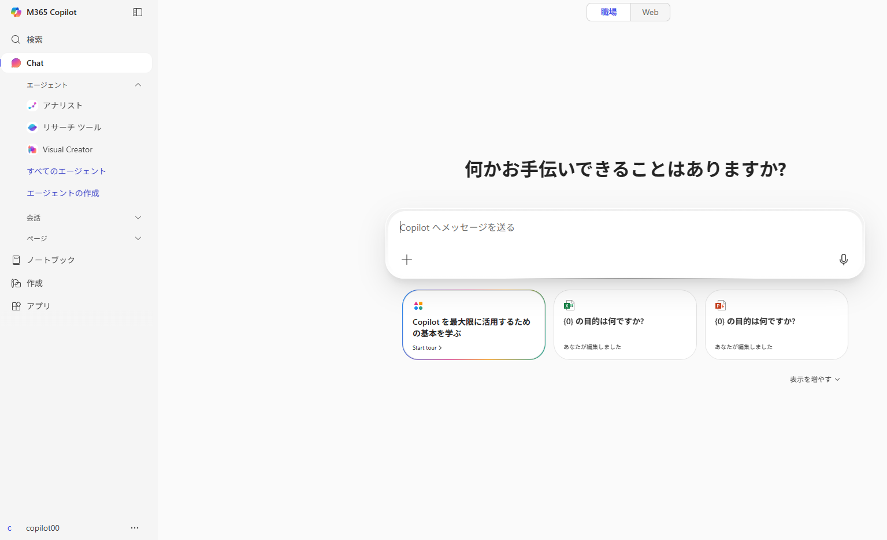
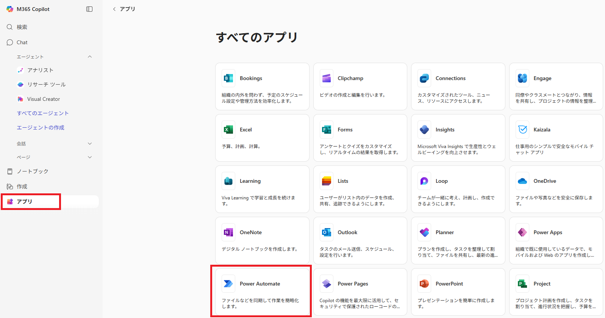
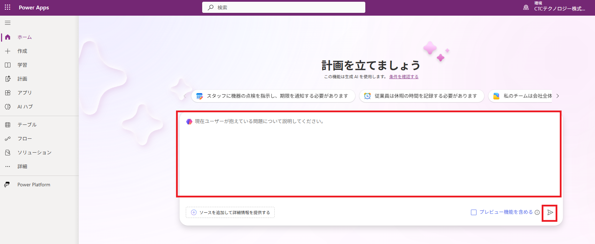

# Lab01：Microsoft 365 Copilotを使ってPower Appsでアプリを作成する 

#### 推定時間: 5 分


## タスク1 - 演習環境へアクセスする

このタスクでは、Microsoft 365 ユーザーポータルへアクセスします。

1. 新しい InPrivate ブラウザー ウィンドウを開きます。

   > 　  どのWebブラウザもウィンドウ右上の設定ボタンから表示することが可能です。
   >
   > 　  Microsoft Edgeでは「InPrivate」ウィンドウ
   >
   > 　  Google Chromeでは「シークレット」ウィンドウ
   >
   > 　  Mozilla Fire Foxでは「プライベート」ウィンドウ

2. https://m365.cloud.microsoft/ へアクセスし、以下のアカウントでサインインします。

   > 注：XXは受講者ごとに異なります。
   >
   > 注：「アカウントの保護にご協力ください」と表示された場合は「今はしない」を選択してください

   | 項目       | 値                                           |
   | ---------- | -------------------------------------------- |
   | ユーザーID | `copilot-4005-XX@ctctedulab.onmicrosoft.com` |
   | パスワード | 講師から配布されたパスワード                 |

3. 左上に **M365 Copilot** の表示があり、左下のアカウント表示が上記の演習用アカウントとなっていればログイン完了となります。

   


## タスク2 - 簡単な指示でファイル管理フローを作成する

このタスクでは、簡単な指示でアプリが作成できるか確認します。今回はタスク管理ができるように必要な画面を作成するように指示します。

1. 画面左側の **アプリ** をクリックして、 **すべてのアプリ→** から **Power Automate** を選択します。

   　

2. 画面中央の入力フォームに以下のプロンプトを入力して、右下の紙飛行機アイコンをクリックして生成を開始します。

   ```prompt
   個人で使用する簡単なタスク管理アプリを作成したいと考えています。
   タスクの作成、タスクを完了/未完了を確認する画面を作成してください。
   ```

   

   > ※ **新しい環境で作成しますか？** が表示された場合は、 **作成** のボタンをクリックして続行します
   >

3. まずはアプリに必要なデータを格納するテーブルが作成されます。 

   内容を確認し、そのままCopilotのペインに表示される **データの作成は終了しましたか？** にある **アプリを保存して開く** をクリックします。

   

   > ※ **作業が完了した場合** が表示された場合は **アプリを保存して開く** のボタンをクリックして続行します

4. アプリが作成され、Power Apps Studioへ移動します。

   > ※ **Power Apps Studio へようこそ** が表示された場合は **スキップ** のボタンをクリックして続行します

   

5. 画面左側に表示されている **ツリービュー** ペインを確認します。データを基準として、アプリに必要な画面が自動的に作成されていることが確認できます。

   各画面の構成を確認し、場合によっては変更を行うことも可能です。

6. 作成されたアプリを確認するには、画面上部の **再生ボタン** をクリックして各デバイスでの見栄えを確認することができます。

   

7. 各ボタンをクリックすることでそれぞれの画面遷移を確認できます。

   

   > ※右上のデバイス状のアイコンをクリックするとそれぞれのデバイスで表示した場合のシミュレーションが可能です
