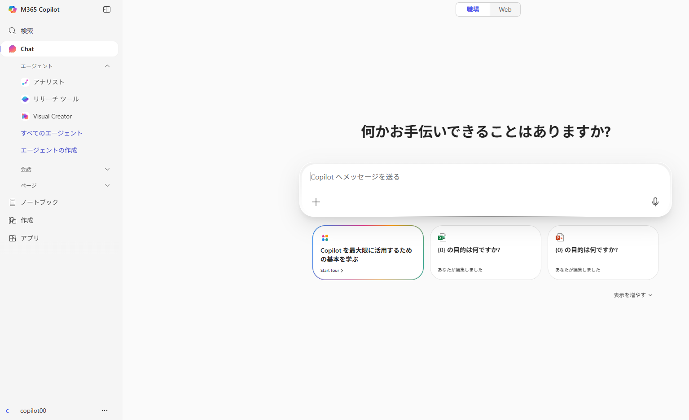
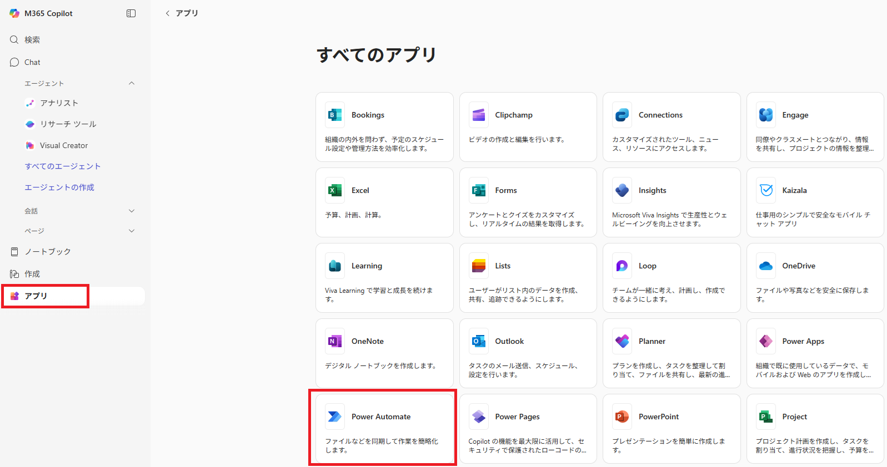
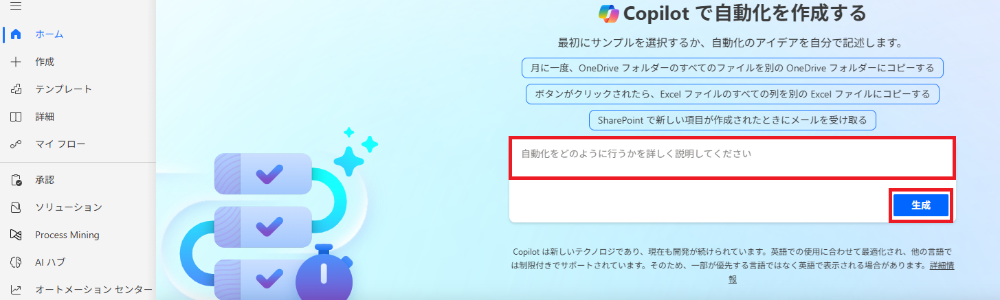
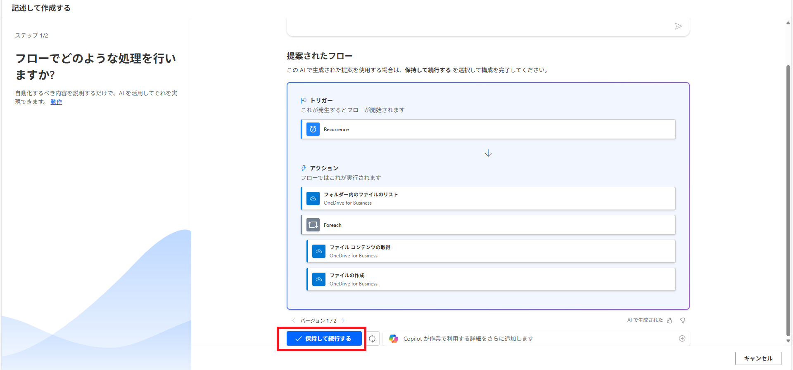
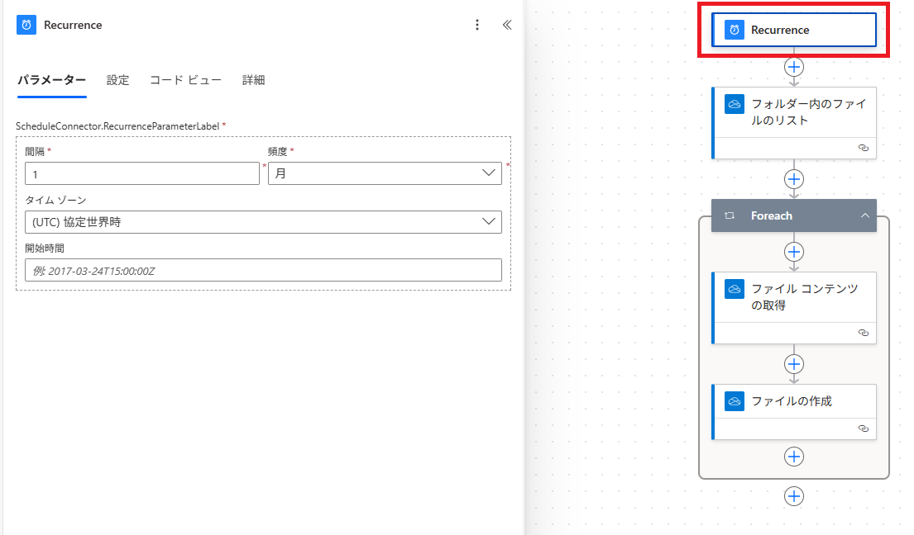
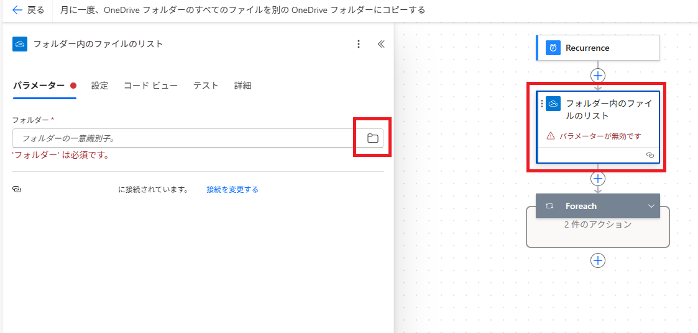
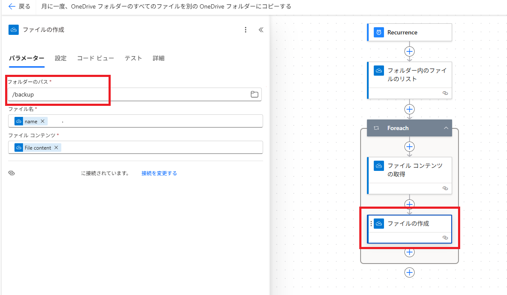

# Lab10：Microsoft 365 Copilotを使ってPower Automateのフローを作成する 

#### 推定時間: 15 分


## タスク1 - 演習環境へアクセスする

このタスクでは、Microsoft 365 ユーザーポータルへアクセスします。

1. 新しい InPrivate ブラウザー ウィンドウを開きます。

   > 　  どのWebブラウザもウィンドウ右上の設定ボタンから表示することが可能です。
   >
   > 　  Microsoft Edgeでは「InPrivate」ウィンドウ
   >
   > 　  Google Chromeでは「シークレット」ウィンドウ
   >
   > 　  Mozilla Fire Foxでは「プライベート」ウィンドウ

2. https://m365.cloud.microsoft/ へアクセスし、以下のアカウントでサインインします。

   > 注：XXは受講者ごとに異なります。
   >
   > 注：「アカウントの保護にご協力ください」と表示された場合は「今はしない」を選択してください

   | 項目       | 値                                           |
   | ---------- | -------------------------------------------- |
   | ユーザーID | `copilot-4005-XX@ctctedulab.onmicrosoft.com` |
   | パスワード | 講師から配布されたパスワード                 |

3. 左上に **M365 Copilot** の表示があり、左下のアカウント表示が上記の演習用アカウントとなっていればログイン完了となります。

   


## タスク2 - 簡単な指示でファイル管理フローを作成する

このタスクでは、簡単な指示でフローが作成できるか確認します。今回はOneDrive上のファイルをバックアップすることを目的として、ファイルを別の場所にコピーするように指示します。

1. 画面左側の **アプリ** をクリックして、 **すべてのアプリ→** から **Power Automate** を選択します。

   　

2. 画面中央の入力フォームに以下のプロンプトを入力して、右下の **生成** ボタンをクリックして生成を開始します。

   ```prompt
   月に一度、OneDriveフォルダーのすべてのファイルを別のOneDriveフォルダーにコピーする
   ```

   

3. フローと必要なアクションが自動的に作成されます。提案されたフローを確認し、 **保持して続行する** をクリックします。

   

4. パラメーターの設定が必要となるため、内容を確認してそれぞれ設定します。

   今回のようにスケジュールに従って実行されるフローでは、トリガーとなる繰り返しの項目（下図では **Recurrence** ）を編集することで、実行間隔や実行時間についてパラメータを設定することが可能です。今回はテスト実行した結果を確認するため、実行タイミングについては変更せずに進めます。

   

5. 今回のフローではバックアップ対象とするファイルリストを取得する必要があるため、 **フォルダー内のファイルリスト** を取得する項目をクリックします。

   対象のフォルダーとして、OneDrive上のルートフォルダ（今回の演習で使用したファイル群が格納されているフォルダ）を指定します。識別子の部分に **/** （スラッシュ）を入力するか、右側のフォルダアイコンをクリックして **Root** をクリックして指定します。

   

6. 続けてコピー先の設定を行います。前処理で取得したファイルリスト内のファイルすべてに対して処理を行うためのループが構成されているはずです。

   ループ内を展開し、 **ファイルの作成** アクションをクリックします。コピー先のフォルダを設定する必要があるため、 **フォルダーのパス** を **/backup** に変更します。

   

7. 画面右上に表示されている **フロッピー状のアイコン（保存ボタン）** をクリックしてフローを保存します。

   フローが保存されると、自動的に初回実行がトリガーされるはずです。

8. M365ユーザーポータルのアプリ一覧からOneDriveを選択し、マイファイルを確認します。先ほど指定したbackupフォルダが作成され、その中に演習で使用したファイルがコピーされているはずです。実行には少し時間がかかる場合があるため、ページを更新することでコピーが作成されていることが確認できます。

   

以上でPower AutomateにおけるCopilotの演習は終了です。
